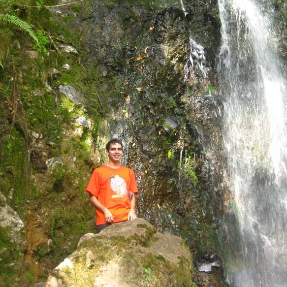

Aside
================================================================================

{width=80%}

Contacto {#contact}
--------------------------------------------------------------------------------

- <i class="fa fa-envelope"></i> jollopezma@unal.edu.co
- <i class="fa fa-globe"></i> [https://leo4luffy.github.io/](https://leo4luffy.github.io/)
- <i class="fa fa-github"></i> [github.com/Leo4Luffy](https://github.com/Leo4Luffy)
- <i class="fa fa-phone"></i> (+57)311 678 5981

Interés {#skills}
--------------------------------------------------------------------------------

**Programación:** R, Python.

**Áreas:** Genética animal, bioestadística.

Disclaimer {#disclaimer}
--------------------------------------------------------------------------------

Esta hoja de vida fue realizada usando el paquete de `R` [**pagedown**](https://github.com/rstudio/pagedown).

Última actualización en `r Sys.Date()`.

Main
================================================================================

Jorge Leonardo López Martínez {#title}
--------------------------------------------------------------------------------

### Zootecnista, MSc en Ciencias Agrarias - Genética animal

Particularmente interesado por la genética animal, la bioestadística y la programación, tengo total interés por continuar complementando mi formación y adquirir mayores conocimientos en estas áreas.

Mi proyecto de vida consiste en ser parte de un grupo de personas con conocimientos variados, que se apoyen mutuamente en miras de alcanzar un objetivo común, la conservación de los recursos genéticos en especies animales.

Me considero una persona responsable y con deseos de superación. Todo ello motivado a sentir orgulloso a mi familia y a las personas que me han formado como persona.

Educación {data-icon=graduation-cap data-concise=true}
--------------------------------------------------------------------------------

### Universidad Nacional de Colombia, sede Medellín

MSc en Ciencias Agrarias - Genética animal

Medellín, Colombia

2018 - 2015

Tesis: Estimación de parámetros genéticos para la producción de leche en el día de control y a los 305 días de lactancia en primera lactancia de vacas Lucerna.

### Universidad Nacional de Colombia, sede Medellín

Zootecnia

Medellín, Colombia

2015

Experiencia {data-icon=laptop}
--------------------------------------------------------------------------------

### Participación en proyectos de investigación en el ganado criollo colombiano Romosinuano

Investigación independiente 

Medellín, Colombia

Presente - 2018

- Edición de los registros productivos y de genealogia. 
- Análisis descritivo de registros productivos.
- Modelación estadística en registros productivos.
- Estimación de parámetros geneticos en registros productivos.

Publicaciones {data-icon=book}
--------------------------------------------------------------------------------

### Modelos mixtos con `R`.

Libro destinado para usuarios de `R` interesados en aplicar modelos mixtos 
En preparación y disponible en el enlace: https://fhernanb.github.io/libro_modelos_mixtos/.

N/A

Presente - 2019

Hernánder Barajas F y **López Martínez J L**.

### Estimación de parámetros genéticos para producción de leche en el día de control y a los 305 días en primeras lactancias de vacas Lucerna.

Livestock Research for Rural Development.

N/A

2019

**López Martínez J L**, Quijano Bernal J H y González Herrera L G.

Presentaciones en congresos {data-icon=chalkboard-teacher}
--------------------------------------------------------------------------------

### Modelado genético de la producción de leche en el día de control utilizando polinomios de Legendre.

Presentación en poster en el XIV encuentro nacional y VII internacional de investigadores de las ciencias pecuarias.

Medellín, Colombia

2017

**López Martínez, J. L**., González Herrera, L. G.

### Parámetros genéticos para la producción de leche en el día de control mediante el uso de modelos de regresión aleatoria.

Presentación en poster en el XIV encuentro nacional y VII internacional de investigadores de las ciencias pecuarias.

Medellín, Colombia

2017

**López Martínez, J. L**., González Herrera, L. G.

### Heredabilidades y tendencias genéticas para la producción de leche en el día de control y producción de leche a los 305 días de lactancia en vacas Lucerna.

Ponencia en el XXV congreso de la asociación latinoamericana de producción animal y XI congreso nordestino de producao animal, la seguridad alimentaria en américa latina.

Recife, Brasil

2016

**López Martínez, J. L**., González Herrera, L. G.

### Estimación de parámetros genéticos para la producción de leche en el día de control y producción de leche a los 305 días en primeras lactancias de vacas Lucerna.

Ponencia en el XXV congreso de la asociación latinoamericana de producción animal y XI congreso nordestino de producao animal, la seguridad alimentaria en américa latina.

Recife, Brasil

2016

**López Martínez, J. L**., González Herrera, L. G.

### Análisis de efectos que influyen en el crecimiento pos-destete en animales de la raza Lucerna y sus cruces.

Ponencia en el XIII encuentro nacional y VI internacional de investigadores de las ciencias pecuarias.

Medellín, Colombia

2015

**López Martínez, J. L**., David Jaramillo, E., González Herrera, L. G. 

### Factores ambientales y genéticos sobre la edad al primer parto en hembras de la raza Romosinuano.

Ponencia en el XVI simposio iberoamericano sobre conservación y utilización de recursos zoogenéticos.

Villavicencio, Colombia

2015

**López Martínez, J. L**., Ossa Saraz, G. A., Quijano Bernal, J. H., Arboleda Zapata, E. M.

Cursos de extensión realizados {data-icon=file}
--------------------------------------------------------------------------------

### Introducción al análisis de datos utilizando Python

Intensidad horaria de 32 horas.

Medellín, Colombia

2019

### Selección genómica y mapeo de QTLs

Intensidad horaria de 64 horas.

Medellín, Colombia

2018

### Genómica aplicada a la producción animal

Intensidad horaria de 64 horas.

Cundinamarca, Colombia

2018

### Introducción al análisis de datos utilizando R, nivel II

Intensidad horaria de 24 horas.

Medellín, Colombia

2018

### Introducción al análisis de datos utilizando R

Intensidad horaria de 24 horas.

Medellín, Colombia

2018

Proyectos {data-icon=chalkboard-teacher}
--------------------------------------------------------------------------------

#### Programación

Hoy en día tengo total interés en los lenguajes de programación R y Python, por lo cual día a día busco aprender más de ellos. Mi interés a futuro consiste en aplicar dichos lenguajes en las ciencias animales (principalmente en genética), desde la preparación de documentos reproducibles e interactivos hasta la creación de paquetes que faciliten a las personas interesadas
aplicar distintas métodologias implementadas.

Referencias personales {data-icon=file}
--------------------------------------------------------------------------------

#### Gustavo Alfonso Ossa Saraz

- Investigador PhD en Corporación Colombiana de Investigación Agropecuaria (Agrosavia) (Cerete-Colombia).
- 312 842 4625
- gossa@agrosavia.org.co

#### Ángel Giraldo Mejia

- Docente MSc en Universidad Nacional de Colombia (Medellín-Colombia). 
- 430 90 34 - 430 91 18
- agiraldom@unal.edu.co

#### Delmis Omar Camargo Rodriguez

- Docente PhD en Universidad Nacional de Colombia (Medellín-Colombia). 
- 300 205 0476
- ocamargo@unal.edu.co

#### Monica Reinartz Estrada

- Docente PhD en Universidad Nacional de Colombia (Medellín-Colombia). 
- 316 833 2577
- mreinart@unal.edu.co

#### Jorge Humberto Quijano Bernal

- Docente MSc en Universidad Nacional de Colombia (Medellín-Colombia). 
- 310 451 7705
- jhquijan@unal.edu.co

#### Jaime Horacio López Hoyos

- Profesional de Investigación en Corporación Colombiana de Investigación Agropecuaria (Agrosavia) (Medellín-Colombia).
- 314 615 3873
- jahlopezho@unal.edu.co - jlopezh@corpoica.org.co
