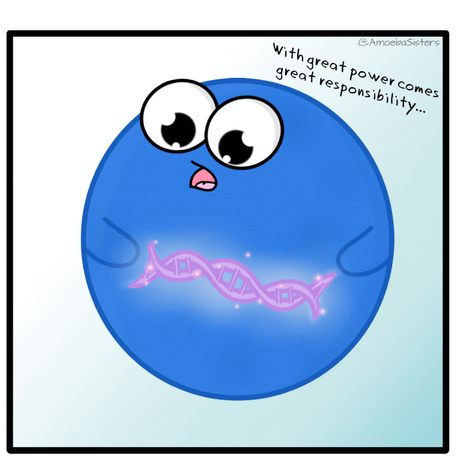

<!--- start of code for font awesome--->

<link rel="stylesheet" href="https://cdnjs.cloudflare.com/ajax/libs/font-awesome/5.11.2/css/all.css" integrity="sha256-46qynGAkLSFpVbEBog43gvNhfrOj+BmwXdxFgVK/Kvc=" crossorigin="anonymous" />
<!--- end of code for font awesome--->

```{r, include=FALSE}
# code from https://github.com/nstrayer/cv
knitr::opts_chunk$set(
  results='asis', 
  echo = FALSE
)
library(tidyverse)
library(glue)

# Set this to true to have links turned into footnotes at the end of the document
PDF_EXPORT <- FALSE

# Holds all the links that were inserted for placement at the end
links <- c()

source('parsing_functions.R')


# Load csv with position info
position_data <- read_csv('positions.csv')

```


Aside
================================================================================
<p align= "center">
{width=80%}
</p>

<i class="fas fa-download"></i> [Descarga mi cv en PDF](https://github.com/Leo4Luffy/Mi_hoja_de_vida/blob/master/index.pdf)

## Información

<i class="fa fa-mobile-alt"></i> +57 311 678 5981

<i class="fas fa-envelope"></i> jollopezma@unal.edu.co

### Redes sociales

<i class="fa fa-github"></i> [github.com/Leo4Luffy](https://github.com/Leo4Luffy)

<i class="fab fa-researchgate"></i> [researchgate](https://www.researchgate.net/profile/Jaime_Lopez_Hoyos)

<i class="fab fa-twitter"></i> [twitter.com/leo4luffy](https://twitter.com/leo4luffy)

### Intereses

<p align= "center">
{width=60%}
</p>

**Áreas**: Genética animal, Bioestadística.
  
**Programación**: R<!--, Python-->.

**Sistema de control de versiones**: Git, GitHub.


Main
================================================================================

Jorge Leonardo López Martínez {#title}
--------------------------------------------------------------------------------

### Zootecnista, MSc en Ciencias Agrarias - Genética animal

Particularmente interesado por la genética animal, la bioestadística y la programación, tengo total interés por continuar complementando mi formación y adquirir mayores conocimientos en estas áreas.

Mi proyecto de vida consiste en ser parte de un grupo de personas con conocimientos variados, que se apoyen mutuamente en miras de alcanzar un objetivo común, la conservación de los recursos genéticos en especies animales.

Me considero una persona responsable y con deseos de superación. Todo ello motivado a sentir orgulloso a mi familia y a las personas que me han formado como persona.


--------------------------------------------------------------------------------

Educación {data-icon=graduation-cap data-concise=true}
--------------------------------------------------------------------------------

```{r}
print_section(position_data, 'education')
```


Experiencia {data-icon=laptop}
--------------------------------------------------------------------------------

```{r}
print_section(position_data, 'research')
```


Publicaciones {data-icon=book }
--------------------------------------------------------------------------------

```{r}
print_section(position_data, 'scientific_journals')
```


Presentaciones en congresos {data-icon=chalkboard-teacher}
--------------------------------------------------------------------------------

```{r}
print_section(position_data, 'oral_communications')
```


Cursos de extensión realizados {data-icon=calendar-check}
--------------------------------------------------------------------------------

```{r}
print_section(position_data, 'short_courses')
```

